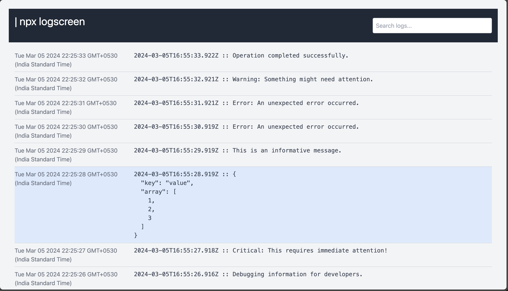

# LogScreen

💻 Hard to search logs?

LogScreen simplifies the process. Piping logs, visualizing in a web app – it's that easy! 

> This tool has been generated entirely with ChatGPT and hence it is also a demonstration of how useful products can be developed with collaborative reiteration with GPTs. 

## Usage

After installation, you can use LogScreen to view command outputs in a browser:

```bash
command | npx logscreen
```

Replace `command` with the actual command you want to execute. LogScreen will start a local server and open the logs in your default web browser.



Here are some examples:

### Example 1: Viewing Docker Logs

```bash
  docker-compose up | npx logscreen
```

This example pipes the logs from a Docker Compose service into LogScreen, providing a more readable and interactive log view.

### Example 2: Monitoring NPM Start Script

```bash
  npm start | npx logscreen
```

If you have a Node.js project with an \`npm start\` script, you can use LogScreen to monitor and navigate through the logs as your application runs.

### Example 3: Tail Command Output

```bash
  tail -f /var/log/syslog | npx logscreen
```

For Linux users, you can use LogScreen with the \`tail\` command to follow and visualize real-time updates in system logs.

#### Monitoring Remote Server Logs

```bash
ssh user@remote-server 'tail -f /path/to/logs' | npx logscreen
```

SSH into a remote server and tail logs in real-time using logscreen for diagnosing issues on a production server.

#### Monitoring Nginx Access Logs

```bash
tail -f /var/log/nginx/access.log | npx logscreen
```

Tail Nginx access logs to observe incoming requests, response codes, and other relevant information.

#### Tail Apache Error Logs

```bash
tail -f /var/log/apache2/error.log | npx logscreen
```

Monitor Apache error logs to identify issues with your web server.

#### Google Cloud Functions Logging:

Use logscreen to monitor logs from Google Cloud Functions, gaining insights into function executions, errors, and overall performance.

```bash
gcloud functions logs read <function-name> | npx logscreen
```

#### Kubernetes Logs

```bash
kubectl logs -f <pod-name> | npx logscreen
```

#### AWS lambda

```bash
aws logs tail /aws/lambda/<function-name> | npx logscreen
```

#### EC2 Instance

```bash
ssh -i <private-key.pem> ec2-user@<instance-ip> 'tail -f /var/log/<your-log-file>' | npx logscreen
```

#### Monitoring Heroku Postgres Queries:

Tail logs related to database queries on a Heroku Postgres database for performance analysis and optimization.

```bash
heroku pg:psql --app <your-app-name> -c "tail -f /var/log/postgresql/postgresql.log" | npx logscreen
```

---

Replace the commands above with your specific use case to leverage the benefits of LogScreen's web-based log viewer.

## Features

- **Web-Based Log Viewer**: Get a cleaner and more organized view of command outputs.
- **Real-Time Updates**: Logs are displayed in real-time as the command executes.
- **Interactive Interface**: Search, filter, and navigate through logs easily. // TODO

## Options

- **Port**: By default, LogScreen uses port 3000. You can specify a different port using the `-p` or `--port` option:

  ```bash
  command | npx logscreen --port 8080
  ```

## Acknowledgments

- [Socket.io](https://socket.io/) for real-time communication.
- [Express](https://expressjs.com/) for the web server.
